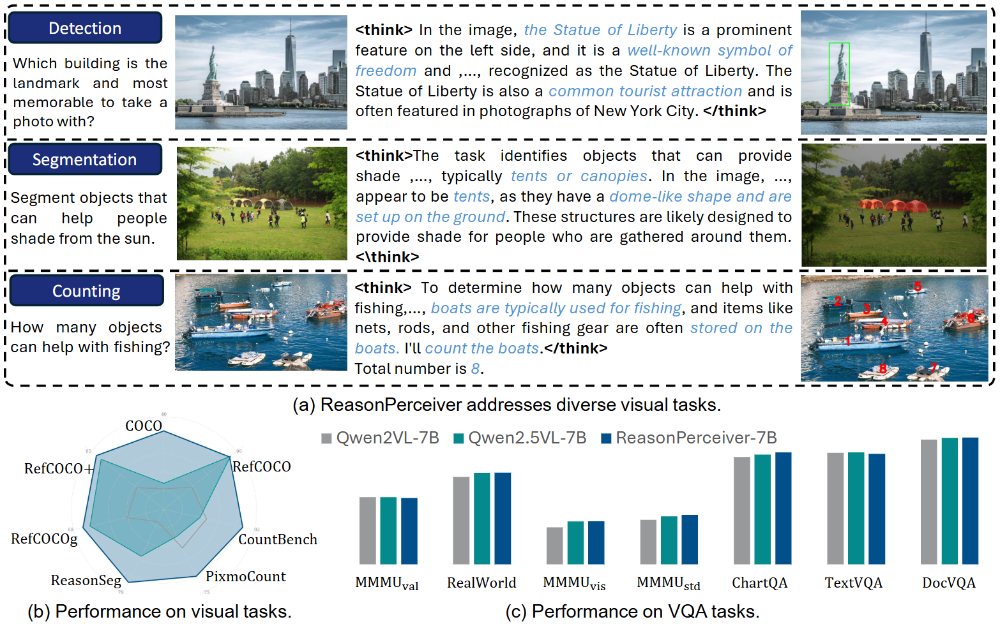

# VisionReasoner: Unified Visual Perception and Reasoning via Reinforcement Learning

> Current VLMs are primarily used for visual captioning or visual QA tasks. In this project, we take a step further by demonstrating the potential of a single VLM to solve diverse vision tasks. We hope this work will advance the frontier of VLM research and expand the boundaries of what these models can achieve.  

Paper: [📖 VisionReasoner](https://arxiv.org/pdf/2505.12081) [📖 Seg-Zero](https://arxiv.org/pdf/2503.06520)         
HuggingFace Daily: [🤗 VisionReasoner](https://huggingface.co/papers/2505.12081)  
Model: [🤗 VisionReasoner-7B](https://huggingface.co/Ricky06662/VisionReasoner-7B) [🤗 TaskRouter-1.5B](https://huggingface.co/Ricky06662/TaskRouter-1.5B)  
Relative Link: [Seg-Zero![[code]](https://img.shields.io/github/stars/dvlab-research/Seg-Zero)](https://github.com/dvlab-research/Seg-Zero)   

Overview of VisionReasoner:

<div align=center>

</div>

VisionReasoner demonstrates following features:
1. **VisionReasoner** is a unified framework for visual perception tasks. Through carefully crafted rewards and training strategy, VisionReasoner has strong multi-task capability, addressing diverse visual perception tasks within a shared model.  
2. We select several representative tasks to evaluate models unified visual ability, including detection tasks (e.g., [COCO](https://cocodataset.org/#home), [RefCOCOg](https://github.com/lichengunc/refer)), segmentation tasks (e.g., [ReasonSeg](https://github.com/dvlab-research/LISA)), counting tasks (e.g., [CountBench](https://teaching-clip-to-count.github.io/)) and VQA tasks (e.g. [DocVQA](https://www.docvqa.org/)).   
3. Experimental results show that VisionReasoner achieves superior performance across ten diverse visual perception tasks within a single unified framework, outperforming baseline models by a significant margin.   
4. We have reformulated dozens of visual task types categoried in [Papers With Code](https://paperswithcode.com/datasets?mod=images&page=1). Please refer to [task categorization](task_categorization.md) for details. These task types are categoried as four fundamental task types: detection, segmentation, counting and VQA. More supported task types and more fundamental task types can be added in this framework, such as 3D or medical image processing.  


## News

[May 17th, 2025] 🔥 [📖 Paper](https://arxiv.org/pdf/2505.12081) is coming!   
[May 17th, 2025] 🔥 VisionReasoner is coming! VisionReasoner is based on our previous [Seg-Zero](https://github.com/dvlab-research/Seg-Zero).  


## Contents
- [Model](#model)
- [Installation](#installation)
- [Inference](#inference)
- [Hybrid Mode](#hybrid-mode)
- [Image Generation](#image-generation)
- [Evaluation](#evaluation)
- [Training](#training)
- [Citation](#citation)
- [Acknowledgement](#acknowledgement)


## Model
<div align=center>

</div>

VisionReasoner model incorporates a reasoning module, which processing image and locates targeted objects, and a segmentation module that produces segmentation masks if needed.   
Besides, we also train a task router that convert diverse vision tasks into given four fundamental task types.


<!-- ## Examples

<div align=center>

</div> -->


## Installation
> [!NOTE]
> If you train VisionReasoner using codes in [Seg-Zero](https://github.com/dvlab-research/Seg-Zero), you can directly use the environment of the training codes.  

```bash
git clone https://github.com/dvlab-research/VisionReasoner.git
cd VisionReasoner
conda create -n visionreasoner_test python=3.12
conda activate visionreasoner_test
pip3 install torch torchvision
pip install -r requirements.txt
```


## Inference
Download model using the following scripts: 
```bash
mkdir pretrained_models
cd pretrained_models
git lfs install
git clone https://huggingface.co/Ricky06662/VisionReasoner-7B
git clone https://huggingface.co/Ricky06662/TaskRouter-1.5B
```
> [!TIP]
> If you encounter issues with connecting to Hugging Face, consider using `export HF_ENDPOINT=https://hf-mirror.com`.   


Then run inference using:
```bash
python vision_reasoner/inference.py
```
### The default task is a counting task.  
> "How many airplanes are there in this image?"

<div align=center>

</div>


You will get the thinking process in command line, like:

> "The image shows a formation of airplanes flying in the sky. Each airplane is distinct and can be counted individually. The planes are arranged in a specific pattern, and there are visible trails of smoke behind them, which is typical for airshows or demonstrations."

And you will get the final answer in command line, like:

> "Total number of interested objects is:  10"


### You can also try a detection / segmentation task by:  
```bash
python vision_reasoner/inference.py --image_path "assets/donuts.png" --query "please segment the donuts"
```

You will get the thinking process in command line, like:

> "The task involves identifying and segmenting individual donuts in the image. Each donut is distinct in its color, glaze, and toppings, which helps in distinguishing them from one another. The goal is to identify each donut as a separate object and provide bounding boxes for them."

And the result will be presented in result_visualization.png. 

<div align=center>

</div>

### Or some tasks that need reasoning: 

```bash
python vision_reasoner/inference.py --image_path "assets/stand_higher.png" --query "find what can make the woman stand higher?"
```

You will get the thinking process in command line, like:

> "The question asks for objects that can make the woman stand higher. The woman is already standing on a ladder, which is the object that elevates her. The ladder is the most closely matched object to what can make her stand higher."

And the result will be presented in result_visualization.png. 

<div align=center>

</div>


### We also support naive visual QA / captioning task:
```bash
python vision_reasoner/inference.py --image_path "assets/company_name.png" --query "What is name of the company?"
``` 

<div align=center>

</div>

In VQA, there are no reasoning, and you will get the final answer in command line, like:

> "The answer is: The name of the company is ITC (Indian Tobacco Company Limited)."

### You can also provide your own image_path and text by:
```bash
python vision_reasoner/inference.py --image_path "your_image_path" --query "your question text"
```

## Hybrid Mode:
When hybrid reasoning mode is enabled, VisionReasoner intelligently switches between direct detection (using YOLO-World) and reasoning-based approaches based on the complexity of the query. This allows for faster responses on simple queries while maintaining detailed reasoning for complex tasks.

### Simple Query Example:
For straightforward queries that can be directly answered by object detection:

```bash
python vision_reasoner/inference.py --image_path "assets/crowd.png" --query "person" --hybrid_mode 
```

Output:

<div align=center>

</div>

In this case, the model directly uses YOLO-World for detection without going through the reasoning process, resulting in faster response times.

### Complex Query Example:
For queries that require spatial reasoning or complex understanding:

```bash
python vision_reasoner/inference.py --image_path "assets/crowd.png" --query "the person who is facing to the camera" --hybrid_mode 
```

Output:
> Thinking process: The task involves identifying the person who is facing the camera and then finding the most closely matched object. In the image, there is a person in the center wearing a white shirt and a black vest, who appears to be facing the camera directly. The other individuals are walking away from the camera, so they are not the target. The person in the white shirt and black vest is the closest match to the description of facing the camera.


<div align=center>

</div>

In this case, the model switches to the reasoning-based approach because the query requires understanding spatial relationships and visual attributes.


## Image Generation:
Our framework can also incorporate generation tasks. We adopt [gpt-image-1](https://platform.openai.com/docs/guides/image-generation?image-generation-model=gpt-image-1) for generation in current version.    

> [!NOTE]
> Bugs might arise from API version mismatches. Please debug and customize based on your API key and version.

### Text-to-image generation 
For text to image generation, you can only input a prompt
```bash
python vision_reasoner/inference.py --image_prompt "Draw a image of a cute dog." --generation_model_name [your openAI api key] --generation_mode 
```

### Image reference generation 
For image reference generation, you should input a prompt and reference image
```bash
python vision_reasoner/inference.py  --refer_image_path "assets/dog.png" --image_prompt "Generate a cute dog in a forest" --generation_model_name [your openAI api key] --generation_mode 
```

## Evaluation

The evaluation scripts allow you to test VisionReasoner on various datasets. We provide scripts for evaluating segmentation, detection, and counting tasks.

### Using the Evaluation Scripts

Each evaluation script accepts either a HuggingFace dataset path or a local dataset path:

```bash
# Using HuggingFace dataset paths (default in examples)
bash evaluation/eval_segmentation.sh Ricky06662/refcoco_val

# Using local dataset paths
bash evaluation/eval_segmentation.sh /path/to/your/local/refcoco_val
```

Additionally, you can customize model paths with the following parameters:

```bash
# Using local model paths (instead of downloading from HuggingFace)
bash evaluation/eval_segmentation.sh [dataset_path] \
  --model_path /path/to/local/VisionReasoner-7B \
  --task_router_model_path /path/to/local/TaskRouter-1.5B
```

### Available Evaluation Scripts

- `eval_segmentation.sh`: Evaluates segmentation performance on RefCOCO, RefCOCO+, RefCOCOg, and ReasonSeg datasets. When the dataset contains bounding box ground truth annotations, it will also output detection metrics.
- `eval_coco.sh`: Evaluates detection performance on COCO dataset
- `eval_count.sh`: Evaluates counting performance on counting benchmarks

### Example Commands

```bash 
# Segmentation/Detection evaluation
bash evaluation/eval_segmentation.sh Ricky06662/refcoco_val
bash evaluation/eval_segmentation.sh Ricky06662/refcoco_testA
bash evaluation/eval_segmentation.sh Ricky06662/refcocoplus_val
bash evaluation/eval_segmentation.sh Ricky06662/refcocoplus_testA
bash evaluation/eval_segmentation.sh Ricky06662/refcocog_val
bash evaluation/eval_segmentation.sh Ricky06662/refcocog_test
bash evaluation/eval_segmentation.sh Ricky06662/ReasonSeg_val
bash evaluation/eval_segmentation.sh Ricky06662/ReasonSeg_test

# COCO evaluation
bash evaluation/eval_coco.sh Ricky06662/coco_val

# Counting evaluation
bash evaluation/eval_count.sh Ricky06662/counting_pixmo_validation
bash evaluation/eval_count.sh Ricky06662/counting_pixmo_test
bash evaluation/eval_count.sh Ricky06662/counting_countbench
```

> [!NOTE]
> If you want to evaluate in expression level on RefCOCO(g/+) as detailed in [Issue12](https://github.com/dvlab-research/VisionReasoner/issues/12), you can try add '**_all**' to eval data, such as '**Ricky06662/refcoco_val_all**'.

### Evaluation on ViSurf

```bash
bash evaluation/eval_segmentation_with_nonobj.sh
```
> [!NOTE]
> Different from VisionReasoner, the results on ViSurf are using different ckpts. And we provide two ckpts for gRefCOCO, details can be seen in `eval_segmentation_with_nonobj.sh` .


## Training

We recommend you to [Seg-Zero](https://github.com/dvlab-research/Seg-Zero) for training the VisionReasoner.  


## Citation

```bibtex
@article{liu2025segzero,
  title        = {Seg-Zero: Reasoning-Chain Guided  Segmentation via Cognitive Reinforcement},
  author       = {Liu, Yuqi and Peng, Bohao and Zhong, Zhisheng and Yue, Zihao and Lu, Fanbin and Yu, Bei and Jia, Jiaya},
  journal      = {arXiv preprint arXiv:2503.06520},
  year         = {2025}
}

@article{liu2025visionreasoner,
  title        = {VisionReasoner: Unified Visual Perception and Reasoning via Reinforcement Learning},
  author       = {Liu, Yuqi and Qu, Tianyuan and Zhong, Zhisheng and Peng, Bohao and Liu, Shu and Yu, Bei and Jia, Jiaya},
  journal      = {arXiv preprint arXiv:2505.12081},
  year         = {2025}
}
```

## Acknowledgement
We would like to thank the following repos for their great work: 

- This work is built upon the [Seg-Zero](https://github.com/dvlab-research/Seg-Zero), [EasyR1](https://github.com/hiyouga/EasyR1) and [veRL](https://github.com/volcengine/verl).
- This work utilizes models from  [Qwen2-VL](https://huggingface.co/Qwen/Qwen2-VL-2B-Instruct), [Qwen2.5-VL](https://huggingface.co/Qwen/Qwen2.5-VL-3B-Instruct), [SAM2](https://huggingface.co/facebook/sam2-hiera-large) and [YOLO-World](https://github.com/AILab-CVC/YOLO-World). 


## Star History

[](https://star-history.com/#dvlab-research/VisionReasoner&Date)